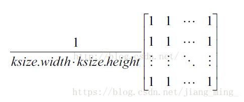

# 图像滤波

## 基础知识

1.  **定义**：图像滤波，即在尽量保留图像细节特征的条件下对目标图像的噪声进行抑制，是图像预处理中不可缺少的操作，其处理效果的好坏将直接影响到后续图像处理和分析的有效性和可靠性。
2. **比喻：**我们可以把滤波器想象成一个包含加权系数的窗口，当使用这个滤波器平滑处理图像时，就把这个窗口放到图像之上，透过这个窗口来看我们得到的图像。
3. **公式：** $$O(i, j) = \sum_{m,n}I(i+m,j+n)K(m,n)$$ **** 其中O\(i, j\)是像素输出值，I\(i+m, j+n\)是像素输入值，K为滤波器（核：二维矩阵，核的不同值表示不同的算法。）
4. **种类**：低通滤波器可以消除噪声、模糊化，高通滤波器可以提取边缘。[白话文讲计算机视觉-第三讲-滤波器](https://blog.csdn.net/u013631121/article/details/80444602?depth_1-utm_source=distribute.pc_relevant.none-task&utm_source=distribute.pc_relevant.none-task)
5. **作用**：图像滤波可以更改或者增强图像。通过滤波，可以强调一些特征或者去除图像中一些不需要的部分。滤波是一个邻域操作算子，利用给定像素周围的像素的值决定此像素的最终的输出值。常见的应用包括去噪、图像增强、检测边缘、检测角点、模板匹配等。

## 算法

### 0x01 均值滤波

1. **定义**：用其像素点周围像素的平均值代替元像素值，在滤除噪声的同时也会滤掉图像的边缘信息。在OpenCV中，可以使用boxFilter和blur函数进行均值滤波。均值滤波的核为：

    2. **代码**

### **0x02 中值滤波**

1. **定义：**中值滤波用测试像素周围邻域像素集中的中值代替原像素。中值滤波去除椒盐噪声和斑块噪声时，效果非常明显。在OpenCV中，可以使用函数medianBlur进行操作。

### 0x03 高斯滤波

1. **定义**：加权平均，距离越近的点权重越大，距离越远的点权重越小。由于图像是二维矩阵，则采用二维高斯函数\(正态分布\)$$f(x,y)= \frac{1}{2πσ^2} e^{\frac{-(x^2+y^2)}{2σ^2}}$$ 。如果原图是彩色图片，可以对RGB三个通道分别做高斯模糊。参考：[高斯模糊（高斯滤波）的原理与算法](https://blog.csdn.net/nima1994/article/details/79776802)
2. **边界处理**：把已有的点拷贝到另一面的对应位置，模拟出完整的矩阵。
3. **公式**：以 q为中心的窗口中，某一点 p在高斯滤波过程中。 权重\(空间\)： $$G(p) = \frac{1}{2πσ^2} e^{\frac{-||p-q||^2}{2σ^2}}$$ 

### 0x04 双边滤波 --  **边缘保护滤波** 

1. **定义**：高斯滤波只考虑了周边点与中心点的空间距离来计算得到权重，会模糊掉边缘。在高斯滤波的基础上加入了像素值\(灰度\)权重项，也就是说既要考虑距离因素，也要考虑像素值差异的影响，像素值越相近，权重越大。参考：[双边滤波详解](http://www.360doc.com/content/17/0306/14/28838452_634420847.shtml)、[【图像处理】——双边滤波](https://blog.csdn.net/u013921430/article/details/84532068)
2. **公式：** 像素值权重     $$G_r= exp(-{\frac{||I_p-I_q||^2}{2σ^2_r}})$$  空间距离权重  $$G_s= exp(-{\frac{||p-q||^2}{2σ^2_s}})$$  滤波窗口内每个像素值的权重和 $$W(q) = \sum_{p\in S} G_s(p)G_r(p)$$ ---用于权重的归一化 滤波结果： $$BF = \frac {1}{W_q}\sum_{p\in S} G_s(p)G_r(p)*I_p$$ 

### 0x05  引导滤波 -- **边缘保护滤波**

\*\*\*\*

