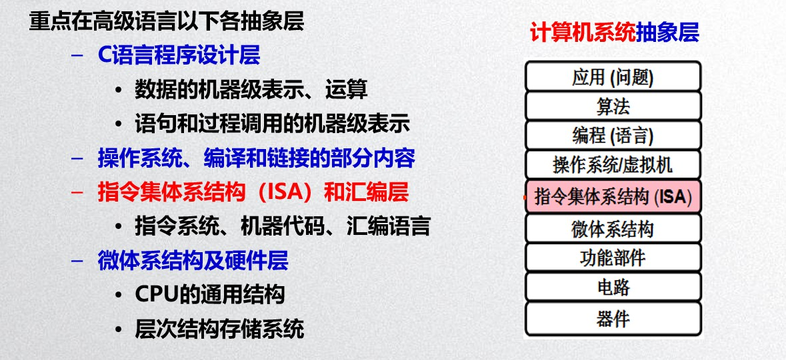
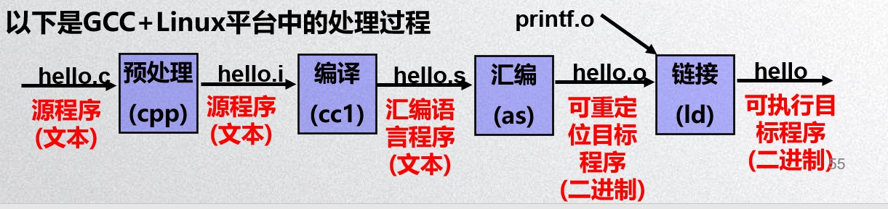
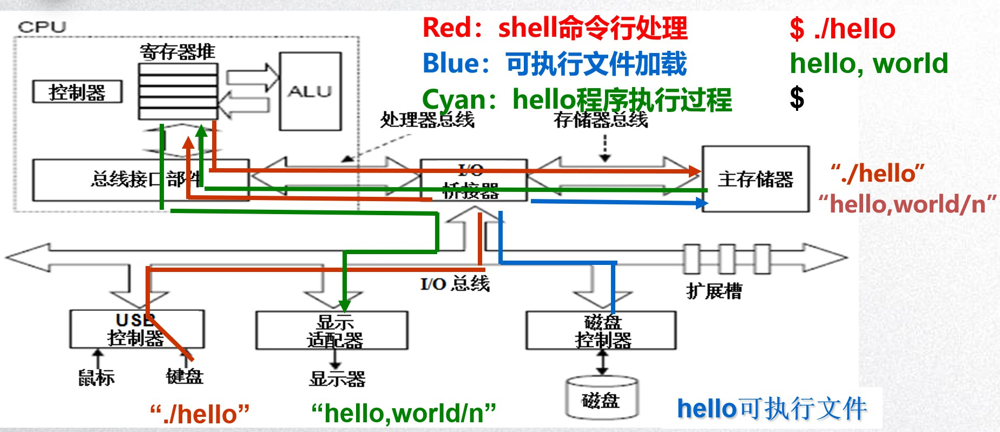
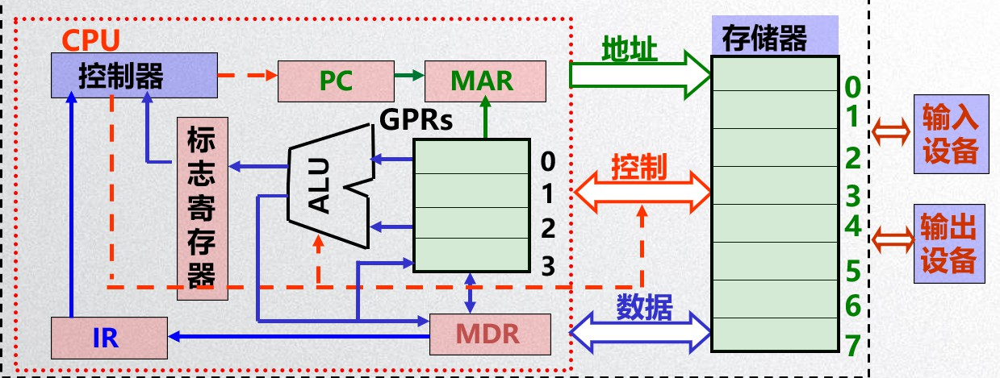
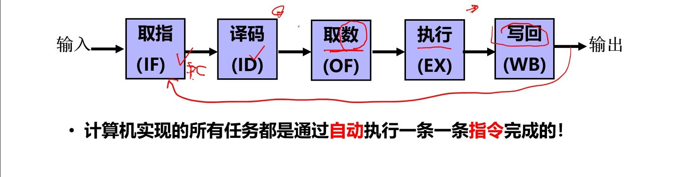

# 第1章 计算机系统基础概述

## 预习问题

### 0x01 计算机和计算器的工作模式是一样的吗？为什么？

 　　不一样。计算器：使用的是固化的处理程序，只能完成特定的计算任务；不能完全自动地实现计算操作，必须有人工参与。计算机：通过编制程序能够自动处理；借助操作系统平台和各类应用软硬件，可以无限扩展其应用领域。

### 0x02 现代计算机的工作过程是怎样的？

　　[存储程序](https://baike.baidu.com/item/%E5%AD%98%E5%82%A8%E7%A8%8B%E5%BA%8F/8800242)和程序控制。计算机的工作过程就是执行程序的过程。先编制程序，通过输入设备把程序送到计算机的存储器中保存起来，即程序存储，然后执行程序。执行程序其实就是逐条执行指令，每条指令的执行又可分为以下四个基本操作：取出指令，即从存储器某个地址中取出要执行的指令送到CPU内部的指令寄存器暂存；分析指令，即把保存在指令寄存器中的指令送到指令译码器'译出该指令对应的微操作；执行指令，即根据指令译码向计算机各部件发出相应控制信号，完成指令规定的操作；为执行下一条指令做好准备，即形成下一条指令地址。

### 0x03 谈谈你对计算机层次结构和ISA的理解。

1. 应用：满足最终用户的需求
2. 算法：算法描述可解决应用问题，使得应用问题的求解变成流程化的清晰步骤
3. 编程语言：程序员进行程序设计将算法转化为用编程语言描述的程序
4. 操作系统/虚拟机：操作系统为所有的语言处理系统提供运行环境，是对计算机底层结构和计算机硬件的一种抽象，这种抽象构成了一台可以让程序员使用的虚拟机
5. ISA理解：位于软硬件交界面。定义了一台计算机可以执行的所有指令的集合，每条指令规定了计算机执行什么操作，所处理的操作数存放的地址空间以及操作数类型。ISA是一种规约，计算机组成的抽象，规定了如何使用硬件所有软件功能都建立在ISA之上。 ISA维基百科解释：[我跳](https://zh.wikipedia.org/wiki/%E6%8C%87%E4%BB%A4%E9%9B%86%E6%9E%B6%E6%A7%8B) ISA百度百科解释：[我跳](https://baike.baidu.com/item/%E6%8C%87%E4%BB%A4%E9%9B%86%E4%BD%93%E7%B3%BB%E7%BB%93%E6%9E%84)
6. 微体系结构：具体实现ISA规定的指令
7. 功能部件：各个功能部件构成微体系结构
8. 电路：电路实现各个功能部件
9. 器件：按照特定的器件技术实现基本的逻辑电路
10. 功能转换：上层是下层的抽象，下层是上层的实现，底层为上层提供支撑环境！

### 0x04 hello.c在计算机中是怎样被运行的？

1. 转换（图2）：hello.c预处理生成hello.i，结果再进行编译生成汇编语言程序hello.s，在经过汇编程序转化为目标程序hello.o，将hello.o与printf.o链接生成可执行目标程序。
2. 执行（图3\)：Shell程序读取字符串" ./hello"中各字符到寄存器，然后存放到主存; "Enter”键输入后，操作系统内核\(载入程序\)根据主存中的字符串"hello“到磁盘上找到特定的hello目标文件，将其包含的指令代码和数据\("hello, world\n"\)从磁盘读到主存，并将控制权转交给hello程序，即将hello程序的第一条指令的地址送到PC中; 处理器从hello主程序的指令代码开始执行; Hello程序将"hello, world\n"串中的字节从主存读到寄存器，再从寄存器输出到显示器上。

## 考点

### 0x01 冯·诺依曼结构的基本构成和基本原理

1.  计算机应由**运算器、控制器、存储器、输入设备和输出设备**五个基本部件组成。
2.  存储器不仅能存放数据，而且也能存放指令，形式上两者**没有区别**，但计算机应能区分数据还是指令；  
3. 控制器应能自动取出指令来执行；
4. 运算器应能进行加/减/乘/除四种基本算术运算，并且也能进行一些逻辑运算和附加运算； 操作人员可以通过输入设备、输出设备和主机进行通信。
5. 内部以二进制表示指令和数据。每条指令**由操作码和地址码两部分组成**。操作码指出操作类型，地址码指出操作数的地址。由一串指令组成程序。
6. 采用“存储程序”工作方式。

### 0x02 计算机指令执行的基本过程


CPU:中央处理器;  PC: 程序计数器;   MAR: 存储器地址寄存器   ALU:算术逻辑部件;   IR:指令寄存器;    MDR:存储器数据寄存器   GPRs:通用寄存器组\(由若干通用寄存器组成，早期就是累加器\)


### 0x03 计算机层次结构中各层出现的原因和作用及ISA在计算机系统结构中的重要作用 --（预习问题3）

### 0x04 hello.c在计算机上运行的全过程 -- （预习问题4）

## 错题记录

1. **汇编语言程序vs. 汇编程序** 　　汇编语言程序就是你用汇编语言写的文本型的程序，我们说用一堆助记符来写的源代码。汇编程序是汇编阶段用来把汇编语言翻译成机器语言指令的程序。二者是不同的概念。引自：[我跳](https://blog.csdn.net/u011240016/article/details/53433811)

## 讨论

### 0x01 你对计算机抽象层次结构的理解是怎样的？是不是觉得这个“抽象”本身就很抽象？也可以说说你的疑问。

1. 计算机系统可以从电路到算法进行多个层次的观察，在每一个较高的抽象层次都隐藏了较低层次的细节和复杂度。
2. 抽象去除了系统中有关部件的不必要的实现细节，使得设计者可以聚焦于有助于问题得到解决的关键方面。
3. 抽象的一个重要特点是修改低层抽象不需要改变它上层的内容，这样就使得各层结构具有通用性，而不至于牵一发而动全身。
4. 感觉可以类比C++中的对象，抽象、封装。

