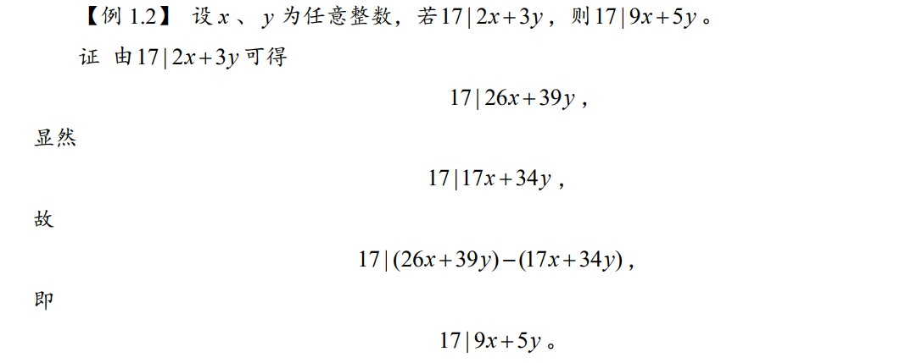
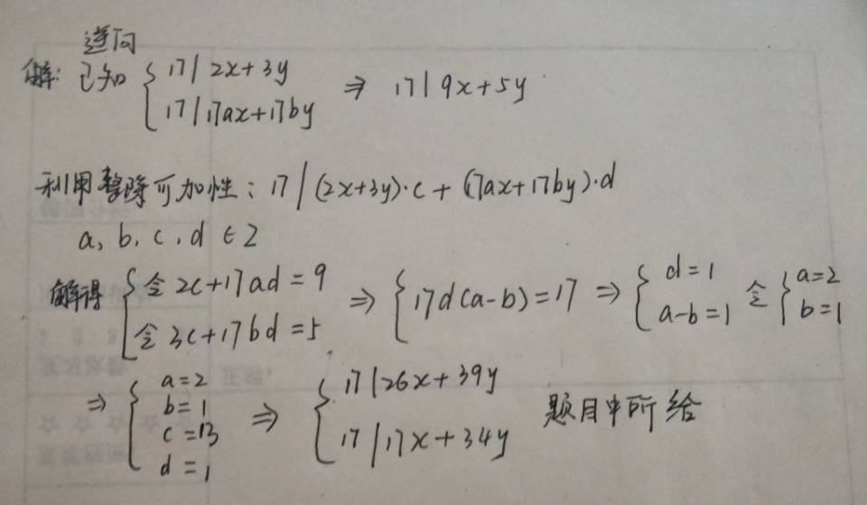
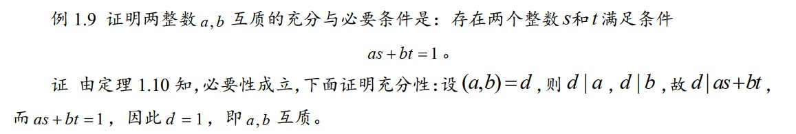
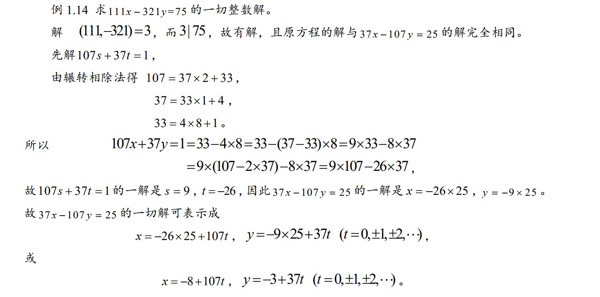

# 第1章 整数的可除性

## 1.1 整除的概念及带余除法

### 0x01 理论知识

**整除定义**：设a，b是任意两个整数，其中 $$b \neq 0$$ ，如果存在一个整数 q 使得 a = bq，则称 b 整除 a 或 a 被 b 整除，记作 $$b | a$$ ，此时 b 叫作 a 的因数，a 叫作 b 的倍数。 若使得 a = bq 成立的整数 q 不存在，则称 b 不整除 a，记作 $$b\nmid a$$ 。

**整除的性质1：**

1. 传递性： $$c| b , \quad b|a \Rightarrow c | a$$ 
2. 可加性： $$m|a, \quad m| b \Rightarrow m | a \pm b$$ ；\(推广： $$m\left|a_{1}, \quad m\right| a_{2}, \dots, m | a_{n}\Rightarrow m | q_{1} a_{1}+q_{2} a_{2}+\cdots+q_{n} a_{n}$$ ， $$q_{1}, q_{2}, \cdots, q_{n} 为任意 n 个整数$$ \)

**带余除法\(欧几里德除法\)：**若 a ， b 是两个整数，其中 b &gt; 0 ，则存在两个唯一 的整数 q 和 r ，使得 $$a=b q+r, \quad 0 \leq r<b$$ 成立。\(定理中 r 为非负最小剩余，若要求 $$|r| \leq b / 2$$， r 称为绝对 最小剩余。\)

**带余除法推论：**若 $$a=b q+r$$ ，则 $$b|a$$ 当且仅当 r = 0 。\(证明 $$b|a$$ 的一个常用技巧：先假设 $$a=b q+r$$ ，推出 r = 0 ，则 $$b|a$$ \)

**整系数多项式的带余除法：**设 $$f(x)=a_{n} x^{n}+a_{n-1} x^{n-1}+\cdots \cdot a_{0}$$ 为 n 次整系数多项式， $$g(x)=x^{m}+b_{m-1} x^{m-1}+\cdots b_{0}$$ 是首项系数为 1 的 $$m(m \geq 1)$$ 次整系数多项式，则存在整系数多项式 $$q(x)$$ 和 $$r(x)$$ ，使得 $$f(x) = g(x)*q(x)+r(x)$$ ，其中 $$r(x)$$ 的次数小于 $$g(x)$$ 的次数。

### 0x02 应考试题

* 整除性质2\(可加性\)

## 1.2 最大公约数和辗转相除法

### 0x01 理论知识

**最大公因数的定义**：设 $$a_{1}, a_{2}, \cdots, a_{n}$$ 是 $$n(n \geq 2)$$ 个整数，若整数 d 是他们之中每个数的因数，那么 d 就叫做 $$a_{1}, a_{2}, \cdots, a_{n}$$ 的一个公因数。 $$a_{1}, a_{2}, \cdots, a_{n}$$ 的公因数中最大的一个叫做最大公因数，记作 $$(a_{1}, a_{2}, \cdots, a_{n})$$ ，若 $$(a_{1}, a_{2}, \cdots, a_{n})=1$$， 我们说 $$a_{1}, a_{2}, \cdots, a_{n}$$ 互质或互素，若 $$a_{1}, a_{2}, \cdots, a_{n}$$ 中任意两个数都互质，我们就说它们两两互质。\(**注**： $$\left(a_{1}, a_{2}, \cdots, a_{n}\right)=\left(\left|a_{1}\right|,\left|a_{2}\right|, \cdots,\left|a_{n}\right|\right)$$，在求整数的最大公因数时，只需求对应正整数的最大公因数即可\)

**最大公因数的性质**：

1. 0 与 b \(b&gt;0\) 的公因数都是 b 的因数， b 的因数也都是 0 与 b 的公因数；
2. $$(0, b)=b,(b>0)$$ 
3. 设 a, b, c 是任意三个不全为 0 的整数，且 $$a=b q+c$$  ，其中 q 是非零整数，则 a, b 与 b, c 有相同的公因数，因而 $$(a,b)=(b,c)$$ 
4. $$a,b$$的公因数与 $$(a,b)$$的因数相同。
5. 若 $$a_{1}, a_{2}, \cdots, a_{n}$$ 是任意 n 个整数，令 $$\left(a_{1}, a_{2}\right)=d_{2}, $$ $$\left(d_{2}, a_{3}\right)=d_{3}, \dots, $$ $$\left(d_{n-1}, a_{n}\right)=d_{n}$$ ，则 $$\left(a_{1}, a_{2}, \cdots, a_{n}\right)=d_{n}$$ 。

**求解最大公因数\(辗转相除法/欧几里德算法\)：**设 a，b 是任意两个正整数  
 ****$$\begin{array}{c} a=b q_{1}+r_{1}, \quad 0<r_{1}<b \\ b=r_{1} q_{2}+r_{2}, \quad 0<r_{2}<b \\ \ldots \ldots \\ r_{n-2}=r_{n-1} q_{n}+r_{n}, \quad 0<r_{n}<b \\ r_{n-1}=r_{n} q_{n+1}+r_{n+1}, \quad r_{n+1}=0 \end{array}$$

由于 $$r_i$$ 不断减小，总可以得到一个余数是零的等式，即 $$r_{n+1}=0$$ ，则 $$(a, b)=r_{n}$$ 。\(**注**：为简化求解过程，也可以要求带余除法中的余数为绝对最小剩余，此时 a，b 的最大公约数为 $$r_n$$ 的绝对值\)

## 1.3 整除的进一步性质及最小公倍数

### 0x01 理论知识

**整除的性质2：**

1. 若 a，b 是任意两个正整数，则存在两个整数 s 和 t，使得 $$(a, b)=s a+t b$$。 \(辗转相除逆用求解s,t\)
2. 设 a，b 是任意两个不全为零的整数，若m是任一正整数，则 $$(a m, b m)=(a, b) m$$ ；
3. 若 $$\delta$$ 是 a，b 的任一公因数， $$\left(\frac{a}{\delta}, \frac{b}{\delta}\right)=\frac{(a, b)}{|\delta|}, \text { 特别地， }\left(\frac{a}{(a, b)}, \frac{b}{(a, b)}\right)=1$$ ；
4. 若 a，b，c 是三个整数， b，c 至少有一个不为零，且 $$(a,c)=1$$ ，则ab，c 与 b，c 有相同的公因数， $$(a b, c)=(b, c)$$ 
5. $$\text { 若 } \mathrm{c|ab}, \quad(a, c)=1, \quad \text { 则 } c | b$$ 

**最小公倍数定义**：设 $$a_{1}, a_{2}, \cdots, a_{n}$$ 是 $$n(n \geq 2)$$ 个整数，若整数 m 是他们每个数的倍数，那么 m 就叫做 $$a_{1}, a_{2}, \cdots, a_{n}$$ 的一个公倍数。 $$a_{1}, a_{2}, \cdots, a_{n}$$ 的一切公倍数中最小正数叫做最小公倍数，记作 $$[a_{1}, a_{2}, \cdots, a_{n}]$$ 。\(**注**：因为乘积 $$|a_{1} \| a_{2}|\cdots| a_{n} |$$就是 $$a_{1}, a_{2}, \cdots, a_{n}$$，所以最小公倍数是存在的。由于任何正整数都不是零的倍数， 所以讨论整数的最小公倍数时， 总是假定这些整数都不是零。 和最大公因数一样，显然有 $$\left[a_{1}, a_{2}, \cdots, a_{n}\right]=\left[\left|a_{1}\right|,\left|a_{2}\right|, \cdots,\left|a_{n}\right|\right]$$， 只需对正整数讨论它们的 最小公倍数\)

**最小公倍数性质**：

1. a，b 的所有公倍数就是 $$ [a,b]$$ 的所有倍数；
2. $$[a, b]=\frac{a b}{(a, b)}$$ \(大于2项的不满足\)
3. 若 $$a_{1}, a_{2}, \cdots, a_{n}$$ 是任意 n 个整数，令 $$\left[a_{1}, a_{2}\right]=m_{2}, $$ $$\left[m_{2}, a_{3}\right]=m_{3}, \dots, $$ $$\left[m_{n-1}, a_{n}\right]=m_{n}$$ ，则 $$\left[a_{1}, a_{2}, \cdots, a_{n}\right]=m_{n}$$ 

### 0x02 应考试题

* 证明互质：设最大公因数为d

## 1.4 素数与算数基本定理

### 0x01 理论知识

**素数定义**：一个大于 1 的整数，如果它的正因数只有 1 和它本身，就叫做素数（或质数）；否
则就叫做合数。

**素数性质**：

1. 设 a 是任一大于 1 的整数，则 a 的除 1 以外的最小正因数 q 是素数，并且当 a 是合数时， $$q \leq \sqrt{a}$$ 
2. 素数的个数是无穷的。\(厄拉多塞筛法不可能造出全部素数，因为素数是无穷多个的\)
3. 设 p 是一素数， a 是任一整数，则有 $$p | a 或 (p, a)=1$$ 
4. 设 $$a_{1}, a_{2}, \cdots, a_{n}$$ 是 $$n(n \geq 2)$$ 个整数，p 是素数，若 $$p | a_{1} a_{2} \cdots a_{n}$$ ，则 p 一定能整除某一个 $$a_k$$ 
5. 形如 $$M(p)=2^{p}-1$$ 的素数称为梅森素数，形如 $$F(n)=2^{2^{n}}+1$$ 的素数称为费马素数。
6. **算数基本定理**：任一大于 1 的整数都能表示成素数的乘积，即对任一大于 1 的整数 a ，有 $$a=p_{1} p_{2} \cdots p_{n}, \quad p_{1} \leq p_{2} \leq \cdots \leq p_{n}$$ ，其中 $$p_{1}, p_{2}, \cdots, p_{n}$$ 是素数，并且此表示方法是唯一的，即若存在 $$a=q_{1} q_{2} \cdots q_{m}, \quad q_{1} \leq q_{2} \leq \cdots \leq q_{m}$$ 其中 $$q_{1}, q_{2}, \cdots, q_{m}$$ 是素数，则 $$m=n, \quad q_{i}=p_{i}, \quad i=1,2, \cdots, n$$ 
7. 标准分解式：任一大于 1 的整数 a 都能够唯一地写成 $$a=p_{1}^{\alpha_{1}} p_{2}^{\alpha_{2}} \cdots p_{k}^{\alpha_{k}}, $$ $$ \alpha_{i}>0, $$ $$i=1, \cdots, k$$ ，其中 $$p_{i}<p_{j}(i<j)$$。a 的任一正因子 d 可表示为： $$d=p_{1}^{\beta} p_{2}^{\beta_{2}} \cdots p_{k}^{\beta_{k}}, $$ $$\alpha_{i} \geq \beta_{i} \geq 0$$ ，$$i=1, \cdots, k$$ ；反之，若 d 可表示为上述形式，则 d 一定是 a 的正因子。
8. 设 a，b 是任意两个正整数，且 $$a=p_{1}^{\alpha_{1}} p_{2}^{\alpha_{2}} \cdots p_{k}^{\alpha_{k}}, \quad \alpha_{i} \geq 0, \quad i=1, \cdots, k$$ ， $$b=p_{1}^{\beta_{1}} p_{2}^{\beta_{2}} \cdots p_{k}^{\beta_{k}}, \quad \beta_{i} \geq 0, \quad i=1, \cdots, k$$ ，则 $$(a, b)=p_{1}^{\gamma} p_{2}^{\gamma_{2}} \cdots p_{k}^{\gamma_{k}}, \quad \gamma_{i}=\min \left(\alpha_{i}, \beta_{i}\right), \quad(i=1, \cdots, k,)$$ ， $$[a, b]=p_{1}^{\delta_{i}} p_{2}^{\delta_{2}} \cdots p_{k}^{\delta_{k}}, \quad \delta_{i}=\max \left(\alpha_{i}, \beta_{i}\right), \quad(i=1, \cdots, k,)$$ ，其中 $$\min \left(\alpha_{i}, \beta_{i}\right)$$ 表示 $$\alpha_{i}, \beta_{i}$$ 中较小的数， $$\max \left(\alpha_{\alpha}, \beta_{\beta}\right)$$ 表示 $$\alpha_{i}, \beta_{i}$$  中较大的数。

**厄拉多塞筛法\(求解不超过整数 N 的素数表\)：**先列出不超过 $$\sqrt{N}$$ 的全体素数，设为 $$2=p_{1}<p_{2}<\cdots<p_{k} \leq \sqrt{N}$$ 然后依次排列 2， 3， …，N，在其中留下 $$p_1=2$$ ,而把 $$p_1$$ 的倍数全部划掉，再留下 $$p_2$$ 而把 $$p_2$$ 的倍数划掉，继续这一步骤，直到最后留下 $$p_k$$ 而把 $$p_k$$ 的倍数划掉，留下的就是不超过 N 的的全体素数。

## 1.5 二元一次不定方程

### 0x01 理论知识

**判断二元一次不定方程是否有解：**设 a，b，c 为整数， a，b 不为零，则方程 $$a x+b y=c$$ 有整数解的充要条件为 $$(a, b) | c$$ 。

**二元一次不定方程求解：**设 a，b，c 为整数， a，b 不为零，则方程 $$a x+b y=c$$ 有特解 $$x_{0}, y_{0}$$，则方程的通解可表示为： $$x=x_{0}-b_{1} t, \quad y=y_{0}+a_{1} t$$ ，其中 $$a_{1}=\frac{a}{(a, b)}, \quad b_{1}=\frac{b}{(a, b)}, \quad t \in Z$$ 

### 0x02 应考试题

* 二元一次不定方程求解

