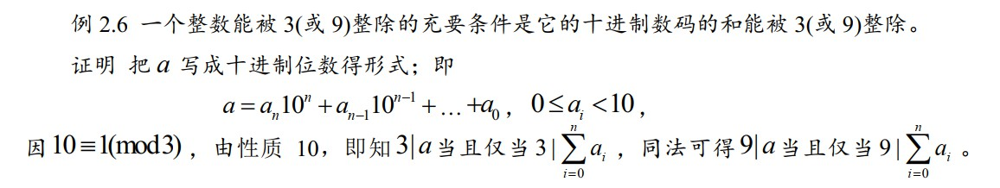
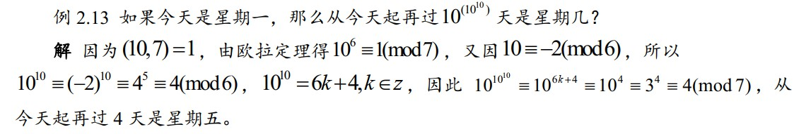
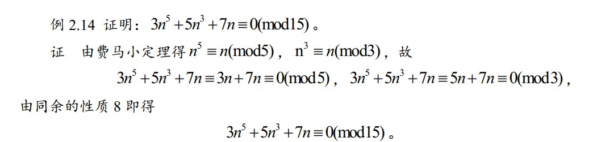
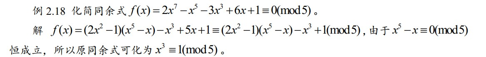
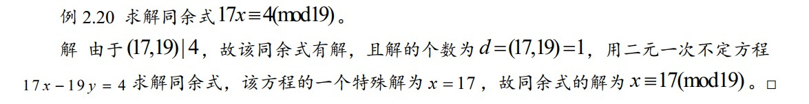
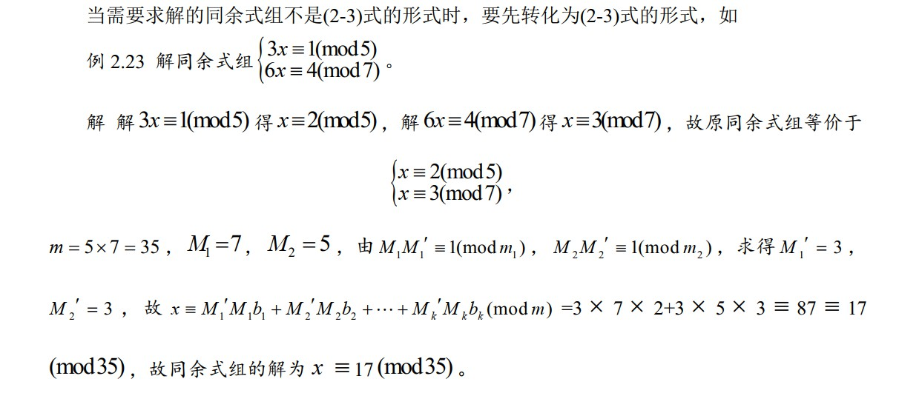
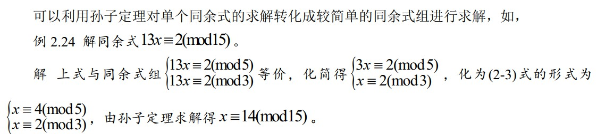
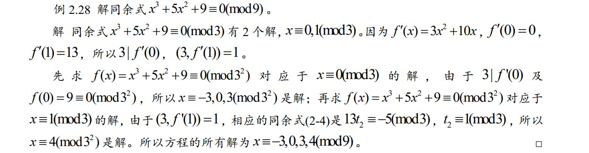

# 第2章 同余与同余式

## 2.0 学习目标

* **初级（计算为主）**：同余的计算、求剩余类与剩余系、利用欧拉定理和费马定理进行计算、解一次同余式、利用孙子定理解一次同余式组、解一般高次同余式
* **进阶（推理证明为主）**：灵活应用同余的性质、欧拉定理、费马定理、孙子定理

## 2.1 同余的概念与性质

### 0x01 理论知识

**同余定义**：给定一个正整数 m，如果用 m 去除任意两个整数 a 和 b 所得的余数相同，则称 a 和 b 模 m 同余， 记作 $$a \equiv b(\bmod m)$$ ；如果余数不同， 则称 a 和 b 模 m不同余， 记作 $$a \not\equiv b(\bmod m)$$ 。

**同余性质：**

1. 整除：$$a \equiv b(\bmod m)$$ 等价条件是 $$m | a-b$$ ，即 $$a=b+m t$$ ， t是整数。特别地， $$a \equiv 0(\bmod m) \Leftrightarrow m|a$$ 
2. 自反性：$$a \equiv a(\bmod m)$$ 
3. 对称性：$$\text {若}a \equiv b(\mathrm{mod} m), \text { 则 } b \equiv a(\bmod m)$$ 
4. 传递性： $$a \equiv b(\mathrm{mod} m), \quad b \equiv c(\mathrm{mod} m), \text { 则 } a \equiv c(\mathrm{mod} m)$$ 
5. 加减法： $$a \equiv b(\mathrm{mod} m), \quad c \equiv d(\mathrm{mod} m), \text { 则 } a \pm c \equiv b \pm d(\mathrm{mod} m)$$ ，特别地，对任意整数 k， $$a \pm k \equiv b \pm k(\bmod m)$$ 
6. 乘法： $$a \equiv b(\mathrm{mod} m), \quad c \equiv d(\mathrm{mod} m), \quad \text { 则 } a c \equiv b d(\mathrm{mod} m)$$ ；特别地，对任意整数 k ， $$a k \equiv b k(\bmod m)$$； $$a^{k} \equiv b^{k}(\bmod m)$$ （推广： $$\text { 若 } a_{i} \equiv b_{i}(\mathrm{mod} m), \quad i=1, \cdots, k$$，对于任意整数 x ，有 $$\sum_{i=1}^{k} a_{i} x^{i} \equiv \sum_{i=1}^{k} b_{i} x^{i}(\bmod m)$$ ）
7. 除法：若 $$a \equiv b(\mathrm{mod} m), a=a_{1} d, \quad b=b_{1} d, \text { 且 }(d, m)=1$$ ，则 $$a_{1} \equiv b_{1}(\bmod m)$$ 
8. 乘法2： $$\text { 若 } a \equiv b(\bmod m), \text { 对任意正整数 } k, \text { 有 } a k \equiv b k(\bmod m k)$$ 
9. 除法2： $$\text { 若 } a \equiv b(\bmod m), \quad d |(a, b, m), \text { 则 } \frac{a}{d} \equiv \frac{b}{d}\left(\bmod \frac{m}{d}\right)$$ 
10. 最小公倍数：$$\text { 若 } a \equiv b\left(\bmod m_{i}\right), \quad i=1, \cdots, k, \quad \text { 则 } a \equiv b\left(\bmod \left[m_{1}, m_{2}, \dots, m_{k}\right]\right)$$ 
11. 因子： $$\text {若 } a \equiv b(\mathrm{mod} m), \quad d | m, \text { 则 } a \equiv b(\mathrm{mod} d)$$ 
12. 同余与最大公因数：$$\text { 若 } a \equiv b(\bmod m), \text { 则 }(a, m)=(b, m)$$ \(若 $$m|a,则m|b$$ \)

### 0x02 应考试题

* 同余性质12

## 2.2 剩余类与剩余系

### 0x01 理论知识

**剩余类定义**：设 $$m \in Z^{+}, \text {令 } K_{a}=\{x | x \equiv a(\bmod m)\}$$ ，称 $$K_a$$ 为模m的一个剩余类， 记作 $$a(\bmod m)$$ 。剩余类中的任一元素称为这个剩余类的代表。（同余关系是整数集合上的一种等价关系，因此可以用同余对整数集合 进行划分，形成剩余类）

**剩余类性质**：（由等价关系的性质易知，剩余类是由同余关系关系导出的等价类，因此满足等价类的所有性 质）

1. 每个剩余类都是一个非空集合；
2. 任意一个整数一定属于模 m的某一个剩余类，同一个剩余类中的数模 m同余，不同剩余类中的数模m不同余；
3. 对于模m的任意两个剩余类 $$K_{a} \text { 和 } K_{b}, \text { 要么 } K_{a}=K_{b}, \text { 要么 } K_{a} \cap K_{b}=\varnothing$$ 
4. 模 m的两两不同的剩余类有m个，且这m个剩余类的并集是全体整数。
5. 若 a，b在同一个剩余类中，即 $$a \equiv b(\bmod m)$$ ，由同余的性质12知， $$(a, m)=(b, m)$$，因此，若 $$(a, m)=1$$ ，则 $$K_a$$ 中所有数都与 m互质，此时， $$K_a$$ 称为与模 m 互质的剩余类。

**剩余系定义**：  
设 $$m \in Z^{+}, \quad K_{0}, K_{1}, \cdots, K_{m-1}$$ 模 m的 m个两两不同的剩余类，从每个剩余类 $$K_i$$ 中取出一个代表 $$a_i$$ ， $$a_{0}, a_{1}, \cdots, a_{m-1}$$ 叫做模m的一个完全剩余系。  
$$0,1, \cdots, m-1$$ 称为模 m 的最小非负完全剩余系 ；  
当 m 是偶数时， $$-m / 2, \cdots,-1,0,1, \cdots, m / 2-1$$ 或 $$-m / 2+1, \cdots,-1,0,1, \cdots, m / 2$$ ，  
当 m 是奇数时， $$-(m-1) / 2, \cdots,-1,0,1, \cdots,(m-1) / 2$$ ，称为模 m的绝对最小完全剩余系。  
这 $$\varphi(m)$$ 个与 m互质的整数组成模m的一个简化剩余系。

**剩余系性质**： 

1. m个整数做成模 m的一个完全剩余系的充要条件是两两对模 m不同余； $$\varphi(m)$$ 个整数做成模 m 的一个简化剩余系的充要条件是两两对模 m 不同余且每个数都与 m 互质。
2. $$\text {设 } m \in Z^{+}, \quad(a, m)=1$$ ，任意整数 b ，若 x 遍历模 m的一个完全剩余系，则 $$a x+b$$ 也遍历模 m的一个完全剩余系。若 x 遍历模 m的一个简化剩余系，则ax也遍历模 m的一个简化剩余系。
3. 设 $$m_1$$ 和 $$m_2$$ 是互质的两个整数，若 $$x_1$$ 和 $$x_2$$ 分别遍历模 $$m_1$$ 和 $$m_2$$ 的一个完全剩余系，则 $$m_{1} x_{2}+m_{2} x_{1}$$ 遍历模 $$m_{1} m_{2}$$ 的一个完全剩余系。若 $$x_1$$ 和 $$x_2$$ 分别遍历模 $$m_1$$ 和 $$m_2$$ 的一个简化剩余系，则 $$m_{1} x_{2}+m_{2} x_{1}$$ 遍历模 $$m_{1} m_{2}$$ 的一个简化剩余系。

**欧拉函数定义**：一个完全剩余系中，与m互质的数的个数称为欧拉函数， 记作 $$\varphi(m)$$ 。（百度定义：在数论，对正整数n，欧拉函数是小于或等于n的正整数中与n互质的数的数目） 

**欧拉函数计算**：

1. 设 $$m_1$$ 和 $$m_2$$ 是互质的两个整数，则$$\varphi\left(m_1m_{2}\right)=\varphi\left(m_{1}\right) \cdot \varphi\left(m_{2}\right)$$ 
2. $$\varphi\left(p^{n}\right)=p^{n}-p^{n-1}$$ ， $$\varphi\left(p\right)=p-1$$ 
3. $$\text { 设 } a=p_{1}^{\alpha_{1}} p_{2}^{\alpha_{2}} \cdots p_{k}^{\alpha_{k}}, \text { 则 } \varphi(a)=a\left(1-\frac{1}{p_{1}}\right)\left(1-\frac{1}{p_{2}}\right) \cdots\left(1-\frac{1}{p_{k}}\right)$$ 

## 2.3 欧拉定理与费马小定理及其在 RSA 公钥密码算法中的应用

### 0x01 理论知识

**欧拉定理**：设m为大于 1 的正整数， $$(a, m)=1$$ ，则 $$a^{\varphi(m)} \equiv 1(\bmod m)$$ 

**费马小定理**：设 p 为素数，则 $$a^{p} \equiv a(\bmod p)$$ 

**应用\(RSA公钥密码算法\)：**此部分老师没做详细介绍，不是考试内容，故放到博客。[我跳](http://dragonliu.tk/2020/06/11/RSA%E5%8A%A0%E5%AF%86%E7%AE%97%E6%B3%95/)

### 0x02 应考试题

* 欧拉定理

* 费马小定理+同余性质10\(最小公倍数\)

## 2.4 同余式的概念及一次同余式

### 0x01 理论知识

**同余式定义**：  
设整系数多项式 $$f(x)=a_{n} x^{n}+a_{n-1} x^{n-1}+\cdots+a_{1} x+a_{0}$$ ，m 是一个正整数，则 $$f(x) \equiv 0(\bmod m)$$ 叫做模m的同余式。  
若 $$a_{n} \not\equiv 0(\bmod m)$$ ，则 n 叫做上式的次数。  
若 a 是满足 $$f(a) \equiv 0(\bmod m)$$ 的一个整数，则 $$x \equiv a(\bmod m)$$ 叫做同余式的一个解。  
当 $$a_1,a_2$$ 均为同余式的解，且对模m不同余时才把它们看作是不同解，把所有对模m两两不同余的解的个数称为同余式的解数。  
**注**：\(满足同余式且模m同余的所有整数今后算作一个解。而只要取模 m的一组完全剩余系代入同余式进行检验就可得到全部不同解。显然，模 m的同余式的解数最多为m\)

**同余式的性质**：同余式的一些性质，用于简化同余式的求解。

1. 费马小定理：设 p 为素数，则同余式 $$x^{p}-x \equiv 0(\bmod p)$$ 有 p 个解。（由费马小定理可得）
2. 倍数：同余式 $$f(x)+m g(x) \equiv 0(\bmod m) \text { 与 } f(x) \equiv 0(\bmod m)$$ 的解相同，一般的，一个同余式中系数为模的倍数的项去掉后，同余式的解不变。
3. 和数：设 $$g(x)$$ 是整系数多项式，则同余式 $$f(x)+g(x) \equiv g(x)(\bmod m) \text { 与 } f(x) \equiv 0(\bmod m)$$ 的解相同。
4. 同余性质：设 $$(a, m)=1$$ ，则同余式 $$a f(x) \equiv 0(\bmod m) \text { 与 } f(x) \equiv 0(\bmod m)$$ 的解相同。
5. 设同余式 $$q(x) \equiv 0(\bmod m)$$ 有 m个解\(即恒等同余式\)，若 $$f(x) \equiv q(x) h(x)+r(x)(\bmod m)$$ 则 $$r(x) \equiv 0(\bmod m) \text { 与 } f(x) \equiv 0(\bmod m)$$ 的解相同。

**一次同余式定义：**当同余式的次数为 1 时就是一次同余式，一般我们将一次同余式写成如下的形式： $$a x \equiv b(\mathrm{mod} m), \quad a  \not\equiv 0(\mathrm{mod} m)$$ 

**一次同余式求解**：一次同余式有解的充分与必要条件是 $$(a, m) | b$$ 。若有解，则解的个数\(对模 m来说\)为 $$d=(a, m)$$ ，它们是 $$x \equiv x_{0}+k m / d(\mathrm{mod} m), \quad k=0,1, \cdots, d-1$$ 

**一次同余式与二元一次不定方程的联系**：适合一次同余式的整数也就是适合不定方程 $$ax-m y=b$$ 的解中 x 的值， 因此可以用求不定方程的方法求解一次同余式。

**步骤：**解同余式 $$a x \equiv b(\bmod m)$$ ，设 $$(a，m)=d$$ 

1. 通过 $$d|b$$ 判断是否有解；
2. $$a, b, m$$ 同时除以d，求 $$a_{1} x \equiv b_{1}\left(\bmod m_{1}\right)$$ 的唯一解 $$x \equiv x_{0}\left(\bmod m_{1}\right)$$ 
3. 唯一解有2种求法： ① 同余式两边同乘 $$a_1^{\varphi(m_1)-1}$$ 将x的系数化为1； ② 转化为二元一次不定方程 $$a _1x-m_1y=b_1$$ 求解
4. 写出 d 个解： $$x \equiv x_{0}+m_{1} k(\bmod m), \quad k=0,1,2, \cdots, d-1$$ 

### 0x02 应考试题

* 同余式化简：性质1

* 一次同余式转化求解：当然，此题还可直接将模 m的一组完全剩余系代入检验；或者利用同余性质6乘法去凑

## 2.5 孙子定理

### 0x01 理论知识

$$\left\{\begin{array}{l} x \equiv b_{1}\left(\bmod m_{1}\right) \\ x \equiv b_{2}\left(\bmod m_{2}\right) \\ \vdots \\ x \equiv b_{k}\left(\bmod m_{k}\right) \end{array}\right.$$ 

**孙子定理\(中国剩余定理\)：**设 $$m_{1}, m, \cdots , m_{k}$$ 是 k 个两两互质的正整数， $$m=m_{1} m_{2} \cdots m_{k},$$ $$ M_{i}=m / m_{i}, $$ $$i=1, \cdots, k$$ ，则同余式组有且只有一个解，这个解是 $$x \equiv M_{1}^{\prime} M_{1} b_{1}+M_{2}^{\prime} M_{2} b_{2}+\cdots+M_{k}^{\prime} M_{k} b_{k}(\bmod m)$$ ，其中 $$M_{i}^{\prime} M_{i} \equiv 1\left(\bmod m_{i}\right), $$ $$i=1, \cdots, k$$   
**性质**：若 $$b_{1}, b_{2}, \ldots, b_{k}$$ 分别遍历模 $$m_{1}, m_{2}, \dots, m_{k}$$ 的完全剩余系，则 $$M_{1}^{\prime} M_{1} b_{1}+M_{2}^{\prime} M_{2} b_{2}+\cdots+M_{k}^{\prime} M_{k} b_{k}$$ 遍历模 $$m=m_{1} m_{2} \cdots m_{k}$$ 的完全剩余系。  

**同余式组求解步骤**

1. 计算 $$m=m_{1} m_{2} \cdots m_{k} \text { 和 } M_{i}=m / m_{i}, \quad i=1, \cdots, k$$ 
2. 通过解同余式 $$M_{i}^{\prime} M_{i} \equiv 1\left(\bmod m_{i}\right) \text { 求出所有 } M_{i}^{\prime}, \quad i=1, \cdots, k$$ 
3. 计算 $$x \equiv M_{1}^{\prime} M_{1} b_{1}+M_{2}^{\prime} M_{2} b_{2}+\cdots+M_{k}^{\prime} M_{k} b_{k}(\bmod m)$$ 

### 0x02 应考试题

* 同余式组求解

* 同余式组求解：利用同余性质10\(最小公倍数\)拆分

## 2.6 素数模高次同余式

### 0x01 理论知识

素数模同余式 $$f(x)=a_{n} x^{n}+a_{n-1} x^{n-1}+\cdots+a_{0} \equiv 0(\bmod p)$$ 其中， p 是素数， $$a_{n} \not\equiv 0(\bmod p)$$

**素数模同余式性质**：

1.  上述同余式与一个次数不超过 $$p-1$$ 的素数模同余式等价。
2. 设 $$k \leq n, \quad x \equiv a_{i}(\bmod p)(i=1,2, \cdots, k)$$ 是上式的 k 个不同解，则对任何整数 x 来说， $$f(x) \equiv\left(x-a_{1}\right)\left(x-a_{2}\right) \cdots\left(x-a_{k}\right) f_{k}(x)(\bmod p)$$ 其中 $$f_{k}(x)$$ 是 $$n-k$$ 次多项式，首项系数是 $$a_{n}$$ 
3. 对任意整数 x 来说， $$x^{p-1}-1 \equiv(x-1)(x-2) \cdots(x-(p-1))(\bmod p)$$ （因式分解）
4. **Wilson 定理：** $$(p-1) !+1 \equiv 0(\bmod p)$$ \(性质3的特例\)
5. 上述同余式的解数不超过它的次数。
6. 设 $$n<p$$ ，同余式 $$f(x)=a_{n} x^{n}+a_{n-1} x^{n-1}+\cdots+a_{0} \equiv 0(\bmod p)$$ 有 n 个解的充分与必要条件是 $$x^{p}-x=f(x) \cdot q(x)+p \cdot r(x)$$ ，其中 $$q(x), \quad r(x)$$ 为整系数多项式，且 $$r(x)$$ 的次数小于 n 。

## 2.7 一般高次同余式的解数和解法

### 0x01 理论知识

**素数幂模同余式**：设 $$x \equiv x_{1}(\bmod p)$$ 是同余式 $$f(x) \equiv 0(\bmod p)$$ 的一个解，且 $$\left(f^{\prime}\left(x_{1}\right), p\right)=1$$ ，则 $$x \equiv x_{1}(\bmod p)$$ 恰好对应了 $$f(x) \equiv 0\left(\bmod p^{\alpha}\right)$$ 的一个解 $$x \equiv x_{\alpha}\left(\bmod p^{\alpha}\right)$$ ，其中 $$x_{1} \equiv x_{\alpha}(\bmod p)$$ 。

**素数幂模同余式求解**： $$f(x) \equiv 0(\bmod p) \text { 的解求 } f(x) \equiv 0\left(\bmod p^{\alpha}\right)$$，在由 $$f(x) \equiv 0\left(\bmod p^{\alpha-1}\right)$$ 的解 $$x \equiv x_{\alpha-1}\left(\bmod p^{\alpha-1}\right)$$ 求 $$f(x) \equiv 0\left(\bmod p^{\alpha}\right)$$ 的解时，由于 ****$$x \equiv x_{\alpha-1}\left(\bmod p^{\alpha-1}\right)$$ 对应了模 $$p^{\alpha}$$ 的 p 个值， $$x \equiv x_{\alpha-1}+t_{\alpha-1} p^{\alpha-1}\left(\bmod p^{\alpha}\right), $$ $$t_{\alpha-1}=0,1, \cdots, p-1$$ ，而满足 $$f^{\prime}\left(x_{\alpha-1}\right) t_{\alpha-1} \equiv-\frac{f\left(x_{\alpha-1}\right)}{p^{\alpha-1}}(\bmod p)$$ 的 $$t_{\alpha-1}$$对应的 x 才是 $$f(x) \equiv 0\left(\bmod p^{\alpha}\right)$$ 的解，因此关键是通过上式求出 $$t_{\alpha-1}$$ 。  
**步骤：**  
① 遍历求解 $$f(x) \equiv 0(\bmod p)$$ ，得 $$x_1$$ ;  
② 令 $$x=x_1+pt_1$$ ，代入 $$f(x) \equiv 0(\bmod p^2)$$ ，在 $$x_1$$ 处泰勒展开： $$f(x_1)+pt_1 f^{\prime}(x_{1}) \equiv 0(\bmod p^2)$$   
③ 两边同除以 $$p$$ 得 $$f^{\prime}\left(x_{1}\right) t_{1} \equiv-\frac{f\left(x_{1}\right)}{p}(\bmod p)$$   
④ 分情况：  
      1. 如果 $$\left(f^{\prime}\left(x_{1}\right), p\right)=1$$ ，则上式恰有一个解，因此 $$x \equiv x_{\alpha-1}\left(\bmod p^{\alpha-1}\right)$$ 只给出了 $$f(x) \equiv 0\left(\bmod p^{\alpha}\right)$$ 的一个解。  
      2. 如果 $$\left(f^{\prime}\left(x_{1}\right), p\right) \neq 1$$ ，即 $$p | f^{\prime}\left(x_{1}\right)$$ ，  
          当 $$\frac{f\left(x_{\alpha-1}\right)}{p^{\alpha-1}} \equiv 0(\bmod p)$$ 时， 上式有 p 个解， 因此 $$x \equiv x_{\alpha-1}\left(\bmod p^{\alpha-1}\right)$$ 就给出了 $$f(x) \equiv 0\left(\bmod p^{\alpha}\right)$$ 的 p 个解；  
          当 $$\frac{f\left(x_{\alpha-1}\right)}{p^{\alpha-1}} \not \equiv 0(\bmod p)$$ 时，上式无解，因此 $$x \equiv x_{\alpha-1}\left(\bmod p^{\alpha-1}\right)$$ 中没有 $$f(x) \equiv 0\left(\bmod p^{\alpha}\right)$$ 的解。  
⑤ 解③中一次同余式得 $$t_1 = t_1'+pt_2$$ ，代入②中 $$x=x_1+pt_1$$ 得 $$x=x_1+p(t_1+pt_2)=x_2+p^2t_2$$   
⑥ 回到②，直到到达求解幂次。

**一般高次同余式解数：**  
设 $$m_{1}, m_{2}, \cdots, m_{k}$$ ****是 k 个两两互质的正整数， $$m=m_{1} m_{2} \cdots m_{k}$$ ，则同余式 $$f(x) \equiv 0(\bmod m)$$ 与同余式组 $$\left\{\begin{array}{l} f(x)=0\left(\bmod m_{1}\right) \\ f(x)=0\left(\bmod m_{2}\right) \\ f(x) \equiv 0\left(\bmod m_{k}\right) \end{array}\right.$$ 等价。如果用 $$T_i$$ 表示 $$f(x) \equiv 0\left(\bmod m_{i}\right)$$ 对模 $$m_i$$ 的解数 $$i=1, \cdots, k, T \text { 表示 } f(x) \equiv 0(\bmod m)$$ 对模m的解数，则 $$T=T_{1} T_{2} \cdots T_{k}$$ 。  
当 $$m=P_{1}^{\alpha_{1}} P_{2}^{\alpha_{2}} \cdots P_{k}^{\alpha_{K}}$$ 时，同余式 $$f(x) \equiv 0(\bmod m)$$ 等价于同余式组 $$f(x) \equiv 0\left(\bmod P^{\alpha_{i}}\right),$$$$ i=1,2, \cdots, k$$ 

**一般高次同余式求解**：由算数基本定理知，任意正整数 m 都可以分解为 $$m=p_{1}^{\alpha_{1}} p_{2}^{\alpha_{2}} \cdots p_{k}^{\alpha_{k}}$$ ，因此，求解 $$f(x) \equiv 0(\bmod m)$$ 就等价于求解同余式组 $$f(x) \equiv 0\left(\bmod p_{i}^{\alpha_{i}}\right), \quad i=1, \cdots, k$$ 

### 0x02 应考试题

* **素数幂模同余式求解**

