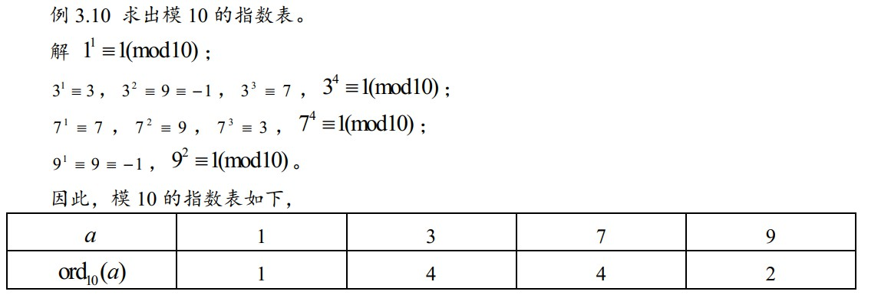
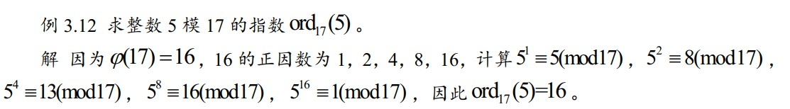
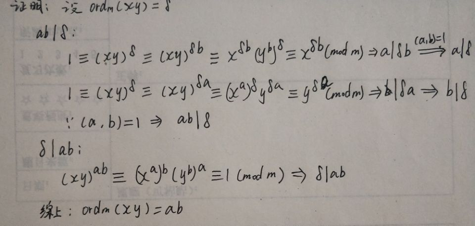

# 第3章 平方剩余与原根

## 3.4 指数及其基本性质

### 0x01 理论知识

**定义3.4.1：**设m是大于1的整数，\(a, m\) = 1，则使得同余式 ****$$a^{\gamma} \equiv 1(\bmod m)$$ ****成立的最小正整数 $$\gamma$$ 叫做 a 对模 m 的指数，记作 $$ord_m(a)$$ 。如果 a 对模 m 的指数是 $$\phi(m)$$ ，则 a 叫做模 m 的一个原根。

**性质3.4.1：** 设（a，m）= 1， $$ord_m(a)=\delta$$ ，则 $$1=a^0, a^1,\dots a^{\delta-1 }$$ 对模m两两不同余。特别地，a是模m的一个原根当且仅当 $$1=a^0, a^1,\dots a^{\delta-1 }$$ 是模m的一个简化剩余系。

**性质3.4.2：**设m是大于1的整数，（a，m）= 1，则 $$a^{k} \equiv a^{s}(\bmod m)$$ 成立的充分与必要条件是 $$k \equiv s\left(\bmod \operatorname{ord}_{m}(a)\right)$$ 。

**推论3.4.1：**设m是大于1的整数，（a，m）= 1，则 $$a^{k} \equiv 1(\bmod m)$$ 的充分与必要条件是 $$k \equiv 0\left(\bmod \operatorname{ord}_{m}(a)\right)$$ ，即 $${ord}_{m}(a)|k$$ 。

**推论3.4.2**_**：**_设m是大于1的整数，（a，m）=1，则 $$\operatorname{ord}_{m}(a) | \varphi(m)$$ 。

**推论3.4.3**_**：**_若a对模m的指数是 $$\delta_1 \delta_{2}$$ ， $$\delta_1>0$$ ， $$\delta_2>0$$ ，则 $$a^{\delta_1}>0$$ 对模m的指数是 $$\delta_{2}$$ 。

### 0x02 应考试题

* 求解指数\(表\)1：利用同余性质简化计算

* 求解指数\(表\)2：要求某个与 m互质的整数 a 的指数，只需验证 $$ \varphi(m)$$ 的所有正因数是否是 a 的指数即可。

* 证明：若x对模m的指数是a，y对模m的指数是b，并且（a，b）= 1，则xy对模m的指数为ab。 

## 3.5 原根

### 0x01 理论知识

_**定义3.5.1**_**：模m的原根存在的充分与必要条件是m=2，4，** $$p^{\alpha}$$ **或** $$2 p^{\alpha}$$ **。**

### 0x02 应考试题

