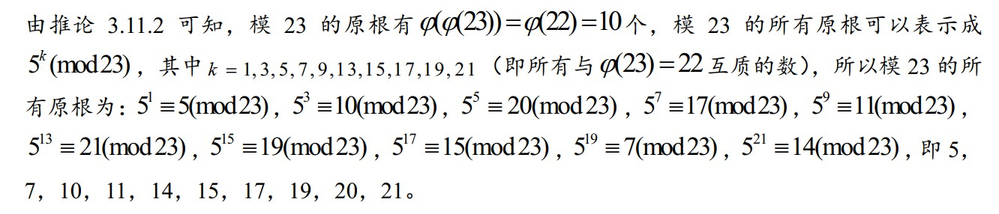

# 第3章 平方剩余与原根

## 3.4 指数及其基本性质

### 0x01 理论知识

**定义3.4.1：**设m是大于1的整数，\(a, m\) = 1，则使得同余式 ****$$a^{\gamma} \equiv 1(\bmod m)$$ ****成立的最小正整数 $$\gamma$$ 叫做 a 对模 m 的指数，记作 $$ord_m(a)$$ 。如果 a 对模 m 的指数是 $$\phi(m)$$ ，则 a 叫做模 m 的一个原根。

**定理3.4.1：** 设（a，m）= 1， $$ord_m(a)=\delta$$ ，则 $$1=a^0, a^1,\dots a^{\delta-1 }$$ 对模m两两不同余。特别地，a是模m的一个原根当且仅当 $$1=a^0, a^1,\dots a^{\delta-1 }$$ 是模m的一个简化剩余系。

**定理3.4.2：**设m是大于1的整数，（a，m）= 1，则 $$a^{k} \equiv a^{s}(\bmod m)$$ 成立的充分与必要条件是 $$k \equiv s\left(\bmod \operatorname{ord}_{m}(a)\right)$$ 。

**推论3.4.1：**设m是大于1的整数，（a，m）= 1，则 $$a^{k} \equiv 1(\bmod m)$$ 的充分与必要条件是 $$k \equiv 0\left(\bmod \operatorname{ord}_{m}(a)\right)$$ ，即 $${ord}_{m}(a)|k$$ 。

**推论3.4.2**_**：**_设m是大于1的整数，（a，m）=1，则 $$\operatorname{ord}_{m}(a) | \varphi(m)$$ 。

**推论3.4.3**_**：**_若a对模m的指数是 $$\delta_1 \delta_{2}$$ ， $$\delta_1>0$$ ， $$\delta_2>0$$ ，则 $$a^{\delta_1}>0$$ 对模m的指数是 $$\delta_{2}$$ 。

### 0x02 应考试题

* 求解指数\(表\)1：利用同余性质简化计算

* 求解指数\(表\)2：要求某个与 m互质的整数 a 的指数，只需验证 $$ \varphi(m)$$ 的所有正因数是否是 a 的指数即可。

* 证明：若x对模m的指数是a，y对模m的指数是b，并且（a，b）= 1，则xy对模m的指数为ab。 

## 3.5 原根

### 0x01 理论知识

_**定理3.5.1**_**：**模m的原根存在的充分与必要条件是 m = 2，4， $$p^{\alpha}$$ 或 $$2 p^{\alpha}$$ 。

_**定理3.5.2**_**：**设 $$\phi(m)$$ 的所有不同素因数为 $$q_1,q_2, …, q_k$$ ，则 g 是模m原根的一个充分必要条件是 $$g^{\varphi(m) / q_{i}} \not \equiv 1(\bmod m), \quad( i=1,2, \cdots, k)$$ 

_**定理3.5.3\(推论3.4.3推广\):**_ $$\text { 设 }(a, m)=1, \quad \operatorname{ord}_{m}(a)=\delta, \quad k \geq 0, \text { 则 } \operatorname{ord}_{m}\left(a^{k}\right)=\delta /(k, \delta)$$ 

_**推论3.5.1:**_  设 $$(a, m)=1, \operatorname{ord}_{m}(a)=\delta, \operatorname{ord}_{m}\left(a^{k}\right)=s$$ ，若 $$(k, \delta)=1$$ ，则 $$\operatorname{ord}_{m}(a)=\operatorname{ord}_{m}\left(a^{k}\right)$$ ，因此在模 m 的简化剩余系中，与 a 指数相同的数有$$\varphi\left(\operatorname{ord}_{m}(a)\right) $$ 个。

_**推论3.5.2:**_  a 是模 m 的一个原根，则当 $$(k, \varphi(\mathrm{m}))=1$$ ， $$a^k$$ 也是模 m 的一个原根，若原根的有 $$\phi(\phi(\mathrm{m}))$$ 个。

### 0x02 应考试题

* 求解原根\(1\)：求解模10的所有原根。定理3.5.2

* 求解原根\(2\)：已知5是模23的一个原根，找出模23的所有原根。推论3.5.2

* 如果知道了模m的一个原根a，则利用 定理3.4.1 可以用a表示出模m的一个简化剩余系，再利用 定理3.5.3，可以计算出简化剩余系中每个元素模m的指数。 

## 3.6 指标

### 0x01 理论知识

_**定义3.5.1**_**：**设 g 是模 m 的一个原根， 任意与 m 互质的整数 a ， 存在唯一整数 $$\gamma$$ ， $$1 \leq \gamma \leq \varphi(m)$$ ，使得 $$g^{\gamma} \equiv a(\bmod m)$$ 成立，这个整数 $$\gamma$$ 叫做以 g 为底的 a 对模 m 的指标或离散对数。记为 $$\gamma=\operatorname{ind}_{g} a \quad \text { (或 ind } a, \text { 或 }log_g a)$$ 

**注：**此处的指标与之前学的对数完全一致，仅仅加上取模的条件。

### 0x02 应考试题

* 如果 g 是模 m 的一个原根， 则当 $$\gamma$$ 遍历模 $$\phi(\mathrm{m})$$ 的非负最小完全剩余系时， $$g^{\gamma}$$ 遍历模 m 的简化剩余系

