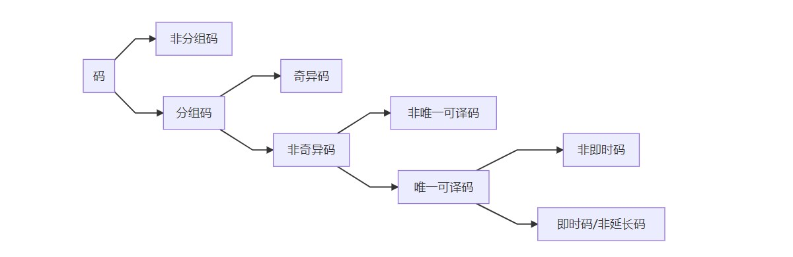

# 第5章 信源编码

1. 编码分为信源编码和信道编码，其中信源编码又分为无失真和限失真。
2. 香农三大极限定理：无失真信源编码定理为第一极限定理，信道编码定理\(包括离散和连续信道\)为第二极限定理，限失真信源编码定理为第三极限定理。
3. 由于信源符号之间存在分布不均匀和相关性，使得信源存在冗余度，信源编码的主要任务就是减少冗余，提高编码效率。
4. 信源编码的基本途径有两个：使序列中的各个符号尽可能地相互独立，即解除相关性；使编码中各个符号出现的概率尽可能地相等，即概率均匀化。
5. 信源编码的作用： 1\)  符号变换：使信源的输出符号与信道
   的输入符号相匹配； 2\)  信息匹配：使信息传输率达到信道容量； 3\)  冗余度压缩：使编码效率等于或接近
   100％

## 5.1 编码的概念

### **01. 码的分类**

1. 定长码：固定长度的码，码中所有码字的长度
   都相同
2. 变长码：可变长度码，码中的码字长短不一

### 02. 分组码的属性

1. 奇异码和非奇异码：若信源符号和码字是一一对应的，则该
   码为非奇异码。反之为奇异码。\(这里的非奇异码满足双射关系\)
2. 唯一可译码：任意有限长的码元序列，只能被唯一地分割
   成一个个的码字，便称为唯一可译码。\(奇异码不是唯一可译码，
   而唯一可译码是非奇异码\)
3. 非即时码和即时码：唯一可译码中又分为非即时码和即时码
   ：如果接收端收到一个完整的码字后，
   不能立即译码，还需等下一个码字开始
   接收后才能判断是否可以译码，这样的
   码叫做非即时码。即时码：只要收到符号就表示该码字已完
   整，可以立即译码。即时码又称为非延长码，任意一个码字都

   不是其它码字的前缀部分，有时叫做异前
   缀码。

### 03. 码树

1. 码树与码字对应：
   1. 树根：码字的起点
   2. 树枝数：码的进制数
   3. 节点：码字或码字的一部分
   4. 节数：码长
   5. 非满树：变长码
   6. 满树：等长码
2. 这样构造的码满足即时码的条件，因为从树根到每一个终端节点所走的路径均不相同，故一定满足对前缀的限制。
3. Kraft不等式：即时码（也是唯一可译码）
   存在的充分必要条件，\(而不是即时码的
   充要条件\)：各码字的
   长度 $$K_i$$ 应符合克劳夫特不等式 $$\sum_{i=1}^{n} m^{-K_{i}} \leq 1$$ 其中m是进制数，n是信源符号。\(克劳夫特不等式只是用来说明唯一可译码是否存在， 并不能作为唯一可译码的判据\)

## 5.2 无失真信源编码定理

用Y表示 L长的信源序列 X，则送出一个信源符号所需要的信息率平均为 $$\bar{K}=\frac{K_{L}}{L} \log m=\frac{1}{L} \log M$$   
编码目的：使 $$\bar{K}$$ 最小  
无失真信源编码必须是唯一可译码  
定长无失真信源编码、定长无失真信源编码

### 01. 定长编码定理

无记忆平稳信源平均符号熵为 $$\boldsymbol{H}_{\mathbf{L}}(\boldsymbol{X})$$ ，只要 $$\frac{K_{L}}{L} \log m \geq H_{L}(\mathbf{X})+\varepsilon$$ 则当 L足够大时，必可使译码差错 $$\delta$$ 足够小；反之，当 $$\frac{K_{L}}{L} \log m \leq H_{L}(\mathbf{X})-2 \varepsilon$$ 时，译码差错一定是有限值，而 L足够大时，译码几乎必定出错。

**说明**：

1. $$K_{L} \log m>L H_{L}(\boldsymbol{X})=H(\boldsymbol{X})$$ ，左边为 $$K_L$$ 长码字所能携带的最大信息量，右边为 L长信源序列携带的信息量。只要码字所能表达的信息量大于信源序列携带的信息量，则可实现无失真信源编码。
2. 当编码器容许的输出信息率 $$\bar{K}=\frac{K_{L}}{L} \log m$$ 大于 $$H_L(X)$$ （单位符号信源熵），一定可以构成一个编码器实现几乎无失真，即译码差错概率接近于零，条件是 L 足够大。
3. 当 $$\bar{K}<H_{L}(\mathbf{X})$$ 时，不可能构成无失真的编码，也就是不可能使译码差错概率趋于零。
4. 当 $$\bar{K}=H_{L}(\mathbf{X})$$ 时，处于临界状态，可能无失真，也可能有失真。
5. 编码定理从理论上阐明了编码效率（信 源熵与输出符号信息率之比）接近1的 理想编码器的存在性，它使输出符号的 信息率与信源熵之比接近于1，即 $$\frac{H_{L}(\mathbf{X})}{\frac{K_{L}}{L} \log m} \rightarrow 1$$ （L取无限长）

**连续信源**：在连续信源的情况下，由于信源的信息量 趋于无限，显然不能用离散符号序列Y来完成 无失真编码，而只能进行限失真编码。

**编码效率**： $$\eta=\frac{H_{L}(\mathbf{X})}{\bar{K}}$$ 

**最佳编码效率**： $$\eta=\frac{H_{L}(\mathbf{X})}{H_{L}(\mathbf{X})+\varepsilon}$$ 、 $$L \geq \frac{\sigma^{2}(X)}{\varepsilon^{2} \delta}$$ 

### 02. 变长编码定理

**单个符号变长编码定理**：若离散无记忆信源的符号熵为 $$H(x)$$ ，每个符号用 m 进制码元进行变长编码，一定存在一种无失真编码方法，其码字平均长度 $$\bar{K}$$ 满足下列不等式 $$\frac{H(X)}{\log m} \leq \bar{K}<\frac{H(X)}{\log m}+1$$ 

**离散平稳无记忆序列变长编码定理**：对于平均符号熵为 $$H_{L}(X)$$ 的离散平稳无记忆信源，必存在一种无失真编码方法， 其码字平均信息率 $$\bar{K}$$ 满足下列不等式 $$H_{L}(X) \leq \bar{K}<H_{L}(X)+\varepsilon$$   
**推出**：  
设用 m 进制码元对 L 长信源符号序列作变长编码，则平均码字长度满足 $$\frac{L H_{L}(X)}{\log m} \leq \bar{K}_{L}<\frac{L H_{L}(X)}{\log m}+1$$  
已知平均输出信息率为 $$\bar{K}=\frac{\bar{K}_{L}}{L} \log m$$， 则 $$H_{L}(X) \leq \bar{K}<H_{L}(X)+\frac{\log m}{L}$$ ，L 足够大时， $$\frac{\log m}{L}<\varepsilon$$ 

**优点**：用变长编码来达到相当高的编码效率， 一般所要求的符号长度 L 可以比定长编码小得多。其平均码长比定长编码的码长要小 得多，编码效率的下界为 $$\eta=\frac{H_{L}(\mathbf{X})}{\bar{K}}>\frac{H_{L}(\mathbf{X})}{H_{L}(\mathbf{X})+\frac{\log m}{L}}$$ 

**码的剩余度\(冗余度\)**： $$\gamma=1-\eta=1-\frac{H_{L}(\boldsymbol{X})}{\frac{\bar{K}_{L}}{L} \log m}=1-\frac{H_{L}(\boldsymbol{X})}{\bar{K}}$$ 

## 5.3 限失真信源编码定理

* 信息率失真函数给出了失真小于 D 时所必须具有的最小信息率 $$R(D)$$ 
* 只要信息率大于 $$R(D)$$ ，一定可以找到一种编码，使译码后的失真小于D。

**限失真信源编码定理**：当信息率 $$R\left(=\frac{\bar{K}}{L} \log m\right)>R(D)$$ 时，只要无记忆信源序列分组长度 L 足够大，一定存在一种编码方法，其译码失真小于或等于 $$D+\varepsilon$$ ， $$\varepsilon$$ 为任意小的正数；反之，若 $$R<R(D)$$ 时，则无论采用什么样的编码方法，其译码失真必大于 D。  
**说明**：

1. $$R(D) \leq \bar{K}<R(D)+1$$ ， $$R(D) \leq \bar{K}<R(D)+\varepsilon$$ 
2. 在失真限度内使信息率任意接近 $$R(D)$$ 的编码方法存在。然而，要使信息率小于 $$R(D)$$ ，平均失真一定会超过失真限度 D。
3. 对于连续平稳无记忆信源，有同样的限失真编码定理。
4. 限失真信源编码定理只能说明最佳编码是存在的，而具体构造编码方法却一无所知。因而就不能象无损编码那样从证明过程中引出概率匹配的编码方法。一 般只能从优化的思路去求最佳编码。实际上迄今尚无合适的可实现的编码方法可接近 $$R(D)$$ 。 

## 5.4 常用信源编码方法

**最佳变长码**：码字的平均长度最短的，码字集合是唯 一可译的变长码称为最佳变长码。

**方法**：大概率符号编以短码字，小概率符号编 以长码字

**最佳码主要有**：香农（Shannon）码、 费诺（Fano）码、哈夫曼（Huffman） 编码等

**变长码传输的两大问题**：需要缓存、差错扩散

### 01. 哈夫曼编码

**编码方法**：

1. 将信源符号按其出现概率的大小依次排列为 $$p_{1} \geq p_{2} \geq \ldots \geq p_{n}$$  
2. 取两个概率最小的符号分别配以 0 和  1 码元，并将其概率相加作为一个新 符号的概率，与未分配的符号重新排队
3. 重排后重复2，直至最后两个符号配以 0 和 1 为止
4. 从最后一级开始，向前返回得到每个信源符号的码元序列，即为相应的码字

**注意**：

1. 构造二\(m\)叉树也是一种好的方法
2. S进制编码，第一次合并的符号数 $$\mathrm{g}^{\prime}=r \bmod (\mathrm{s}-1)$$ 
3. 哈夫曼码的平均码长最小，信息传输率最大，编码效率最高
4. 哈夫曼编码方法得到的码并非唯一：0 和 1 是任意赋予的，得到不同码字，但平均长度不变；当出现相同概率时，其排序可以任意，得到不同的码字，其长度也变化。一般将合并的概率放在前面，这样可以获得较小的 码长方差。并减少再次合并的次数，充分 利用短码

**特点**：哈夫曼编码也属于概率匹配方法

1. 保证概率大的符号对应于短码，概率小的符号对应于长码，充分利用了短码
2. 缩减信源的最后两个码字总是最后一位不同，从而保证了哈夫曼码是即时码
3. 最长的两个码字的长度相同

**意义**：

1. 哈夫曼变长码的效率是相当高的，可以 对单个符号或较短的信源序列编码。对 长序列编码可以达到更高的编码效率。
2. 当信源有记忆时，用单个符号编制变长码不可能使编码效率接近于1，因为信息率只能接近 $$ H_1$$ ，而 $$H_∞$$ 一定小于 $$ H_1$$ 。多个符号一起编码，才能进一步提高效率， 但导致码表长、存储器多。

### 02. 算术编码

**块码\(分组码\)特点**：

1. 符号与码字对应；
2. 符号多元，但不考虑相关性，信源编码的匹配原则不能充分满足，编码效率有所损失；
3. 若要较好地解除相关性，要处理较长的序列，计算量与存储量随着长度呈指数增长。

**基本思想**：非分组码

1. 从全序列出发，积累概率 $$P(S)$$ 把区间 $$[0,1)$$ 分割成许多小区间，每个小区间的长度等于各序列的概率 $$p(S)$$ ，小区间内的任一点可用来代表这序列；
2. 在区间内取一个二进制小数，其码字长度与该序列的概率匹配，达到高效率编码的目的；
3. 把积累概率 $$P(S) $$ 写成二进位的小数，取 其前 $$L(L= \lceil \log \frac{1}{p(S)}\rceil)$$ 位；如果有尾数，就进位到第L位 ，这样得到一个数 $$ C$$\( 码字\)

**实际编码过程**：

1. 先设定两个存储器，起始值为 $$A(\phi)=1, C(\phi)=0$$ 。每输入一个信源符号，存储器就按迭代式 $$\begin{array}{l} C(S, r)=C(S)+A(S) P_{r} \\ A(S, r)=A(S) p_{r} \end{array}$$ 更新一次，直至符号输入完毕，就可将存储器 C 的内 容作为该序列的码字输出。
2. $$A(S) $$ 越来越小， $$C(S) $$ 的增量也越来越小， 其前面几位逐渐固定，不再更新，可以 边计算边输出，只需保留后面几位用作更新
3. 译码也可逐位进行，与编码过程类似。

### 03. LZ编码

### 04. 游程编码

### 05. 矢量量化编码

### 06. 预测编码

### 07. 交换编码

### 08. 香农码

**理论基础**：香农第一定理（无失真信源编码定理） 指出了平均码长与信源熵之间的极限关系；选择每个码字的长度 $$K_{i}$$ 满足 $$I\left(x_{i}\right) \leq K_{i}<I\left(x_{i}\right)+1$$ ，就可以得到最佳码。

**编码方法**：

1. 将信源符号按其出现概率的大小依次排列为 $$p_{1} \geq p_{2} \geq \ldots \geq p_{n}$$ 
2. 确定满足 $$-log b\left(p_{i}\right) \leq K_{i}<-log b\left(p_{i}\right)+1$$ 的码长 $$K_i$$ 
3. 为了编成唯一可译码，计算第 i个符号 的累加概率 $$P_{i}=\sum_{k=1}^{i-1} p_{k}$$ 
4. 将累加概率 $$P_i$$ 变换成二进制数
5. 取该二进制数小数点后 $$K_i$$ 位即为该符号的二进制码字

**意义**：香农编码多余度较大，实用性不强，但 它是依据编码定理而来，因此具有重要的理论意义。

### 09. 费诺码

**编码方法**：

1. 将信源符号按其出现概率的大小依次排列为 $$p_{1} \geq p_{2} \geq \ldots \geq p_{n}$$ 
2. 信源符号分为两大组，使两组的概率近似相同，每组赋予一个码元 0 和 1
3. 将每组符号再分成两组，使两组的概率近似相同，同样赋予码元 0 和 1
4. 重复，直至每组只剩一个信源符号为止
5. 信源符号所对应的码字即为费诺码

**意义**：费诺编码属于概率匹配编码，但不是最佳的编码方法

### 10. 定长编码与变长编码

<table>
  <thead>
    <tr>
      <th style="text-align:center"></th>
      <th style="text-align:center">&#x5B9A;&#x957F;&#x7F16;&#x7801;</th>
      <th style="text-align:center">&#x53D8;&#x957F;&#x7F16;&#x7801;</th>
    </tr>
  </thead>
  <tbody>
    <tr>
      <td style="text-align:center">&#x7F16;&#x7801;&#x5668;</td>
      <td style="text-align:center">&#x590D;&#x6742;&#xFF0C;&#x6548;&#x7387;&#x4F4E;</td>
      <td style="text-align:center">&#x7B80;&#x5355;&#xFF0C;&#x6548;&#x7387;&#x9AD8;</td>
    </tr>
    <tr>
      <td style="text-align:center">&#x65E0;&#x5931;&#x771F;</td>
      <td style="text-align:center">&#x903C;&#x8FD1;</td>
      <td style="text-align:center">&#x771F;&#x6B63;</td>
    </tr>
    <tr>
      <td style="text-align:center">&#x8BD1;&#x7801;</td>
      <td style="text-align:center">&#x7B80;&#x5355;</td>
      <td style="text-align:center">&#x590D;&#x6742;</td>
    </tr>
    <tr>
      <td style="text-align:center">&#x4F20;&#x8F93;</td>
      <td style="text-align:center">&#x4E0D;&#x9700;&#x8981;&#x7F13;&#x5B58;</td>
      <td style="text-align:center">
        
&#x9700;&#x8981;&#x7F13;&#x5B58;&#xFF0C;&#x9002;&#x7528;&#x4E8E;&#x77ED;&#x5E8F;
           
        

        
&#x5217;&#xFF0C;&#x8981;&#x6C42;&#x7801;&#x5B57;&#x957F;&#x5EA6;&#x65B9;&#x5DEE;
           
        

        
&#x5C3D;&#x53EF;&#x80FD;&#x5C0F;

      </td>
    </tr>
    <tr>
      <td style="text-align:center">&#x5DEE;&#x9519;</td>
      <td style="text-align:center">&#x65E0;&#x5DEE;&#x9519;&#x4F20;&#x9012;</td>
      <td style="text-align:center">&#x5DEE;&#x9519;&#x4F20;&#x9012;&#xFF0C;&#x5F15;&#x5165;&#x540C;&#x6B65;&#x7801;</td>
    </tr>
  </tbody>
</table>

